# 🎯 AI Call Summarization System - Mermaid Diagrams

## 📋 How to Use These Diagrams

1. **Copy the Mermaid code** from each section
2. **Paste into any Mermaid renderer**:
   - [Mermaid Live Editor](https://mermaid.live/)
   - GitHub markdown (renders automatically)
   - VS Code with Mermaid extension
   - draw.io (supports Mermaid)
   - Notion, GitLab, etc.

3. **Export as PNG/SVG** for presentations

---

## 🏗️ System Architecture Overview

```mermaid
graph TB
    subgraph "AI Call Summarization Platform"
        subgraph "Frontend Layer"
            FE[🖥️ Streamlit Web App<br/>Port: 8501<br/>• Upload Interface<br/>• Dashboard<br/>• Real-time Updates]
        end
        
        subgraph "Backend Services"
            API[⚡ FastAPI Router<br/>Port: 8000]
            WS[🔄 WebSocket Handler<br/>Real-time Updates]
            AUDIO[🎵 Audio Processor<br/>Cleaning & Enhancement]
            AI[🤖 AI Service<br/>OpenAI Integration]
            DB_MGR[🗄️ Database Manager<br/>MongoDB Operations]
            SANITIZER[🔒 Transcript Sanitizer<br/>Privacy Protection]
        end
        
        subgraph "Data Layer"
            MONGO[(🗄️ MongoDB<br/>Port: 27017<br/>• calls collection<br/>• metadata<br/>• analytics)]
            STORAGE[📁 File Storage<br/>/tmp/audio<br/>• Temp files<br/>• Processed audio]
        end
        
        subgraph "External Services"
            WHISPER[🎯 OpenAI Whisper<br/>Speech-to-Text]
            GPT4[🧠 GPT-4<br/>Analysis & Insights]
        end
    end
    
    %% Connections
    FE <==> API
    API --> WS
    API --> AUDIO
    API --> AI
    API --> DB_MGR
    AUDIO --> SANITIZER
    AI --> WHISPER
    AI --> GPT4
    DB_MGR --> MONGO
    AUDIO --> STORAGE
    
    %% Styling
    classDef frontend fill:#3498db,stroke:#2c3e50,stroke-width:2px,color:#fff
    classDef backend fill:#e74c3c,stroke:#c0392b,stroke-width:2px,color:#fff
    classDef data fill:#2ecc71,stroke:#27ae60,stroke-width:2px,color:#fff
    classDef external fill:#f39c12,stroke:#e67e22,stroke-width:2px,color:#fff
    
    class FE frontend
    class API,WS,AUDIO,AI,DB_MGR,SANITIZER backend
    class MONGO,STORAGE data
    class WHISPER,GPT4 external
```



---

## 🔄 Audio Processing Pipeline

```mermaid
flowchart LR
    subgraph "Audio Processing Pipeline"
        INPUT[📁 Input Audio<br/>MP3, WAV, OPUS<br/>M4A, OGG, WebM]
        
        subgraph "Stage 1: Format Conversion"
            CONVERT[🔄 Convert to WAV<br/>16kHz Sample Rate<br/>Mono Channel<br/>pydub + FFmpeg]
        end
        
        subgraph "Stage 2: Audio Enhancement"
            ENHANCE[🎯 Audio Enhancement<br/>Volume Normalization<br/>High-pass Filter 80Hz<br/>Low-pass Filter 8kHz<br/>librosa + scipy]
        end
        
        subgraph "Stage 3: Speech Analysis"
            ANALYZE[📊 Speech Analysis<br/>RMS Energy Detection<br/>Zero Crossing Rate<br/>Spectral Centroid<br/>Speech Segmentation]
        end
        
        OUTPUT[✨ Enhanced Audio<br/>Optimized for AI<br/>95%+ Accuracy<br/>Noise Reduced]
    end
    
    INPUT --> CONVERT
    CONVERT --> ENHANCE
    ENHANCE --> ANALYZE
    ANALYZE --> OUTPUT
    
    %% Performance Metrics
    METRICS[⚡ Performance<br/>2-3x Real-time<br/>50+ Concurrent<br/>Auto Cleanup]
    
    OUTPUT -.-> METRICS
    
    %% Styling
    classDef input fill:#3498db,stroke:#2c3e50,stroke-width:2px,color:#fff
    classDef process fill:#e74c3c,stroke:#c0392b,stroke-width:2px,color:#fff
    classDef output fill:#2ecc71,stroke:#27ae60,stroke-width:2px,color:#fff
    classDef metrics fill:#f39c12,stroke:#e67e22,stroke-width:2px,color:#fff
    
    class INPUT input
    class CONVERT,ENHANCE,ANALYZE process
    class OUTPUT output
    class METRICS metrics
```



---

## 🤖 AI Analysis Flow

```mermaid
flowchart TD
    subgraph "AI Analysis Pipeline"
        CLEAN_AUDIO[🎵 Enhanced Audio<br/>16kHz, Mono, Cleaned]
        
        subgraph "Transcription"
            WHISPER[🎯 OpenAI Whisper<br/>Speech-to-Text<br/>95%+ Accuracy]
        end
        
        subgraph "Privacy Protection"
            SANITIZER[🔒 Transcript Sanitizer<br/>Zimbabwe-Specific Patterns]
            
            subgraph "Sanitization Patterns"
                PHONE[📞 Phone Numbers<br/>0788405008 to PHONE_NUM]
                MONEY[💰 Currency Amounts<br/>500 USD to AMOUNT]
                NAME[👤 Customer Names<br/>John Doe to CUSTOMER]
                ACCOUNT[🏦 Account Numbers<br/>123456789 to ACCOUNT_NUM]
            end
        end
        
        subgraph "AI Analysis"
            GPT4[🧠 GPT-4 Analysis<br/>Advanced Insights]
        end
        
        subgraph "Results"
            SUMMARY[📝 Call Summary]
            SENTIMENT[😊 Sentiment Analysis]
            CATEGORY[📂 Call Categorization]
            ACTIONS[✅ Action Items]
        end
    end
    
    CLEAN_AUDIO --> WHISPER
    WHISPER --> SANITIZER
    SANITIZER --> GPT4
    GPT4 --> SUMMARY
    GPT4 --> SENTIMENT
    GPT4 --> CATEGORY
    GPT4 --> ACTIONS
    
    %% Privacy examples
    SANITIZER -.-> PHONE
    SANITIZER -.-> MONEY
    SANITIZER -.-> NAME
    SANITIZER -.-> ACCOUNT
    
    %% Styling
    classDef audio fill:#3498db,stroke:#2c3e50,stroke-width:2px,color:#fff
    classDef ai fill:#e74c3c,stroke:#c0392b,stroke-width:2px,color:#fff
    classDef privacy fill:#f39c12,stroke:#e67e22,stroke-width:2px,color:#fff
    classDef results fill:#2ecc71,stroke:#27ae60,stroke-width:2px,color:#fff
    classDef patterns fill:#9b59b6,stroke:#8e44ad,stroke-width:1px,color:#fff
    
    class CLEAN_AUDIO audio
    class WHISPER,GPT4 ai
    class SANITIZER privacy
    class SUMMARY,SENTIMENT,CATEGORY,ACTIONS results
    class PHONE,MONEY,NAME,ACCOUNT patterns
```



---

## 📊 Real-time Processing Timeline


---

## 🐳 Docker Container Architecture

```mermaid
graph TB
    subgraph "Docker Compose Orchestration"
        subgraph "ai-call-network"
            subgraph "Frontend Container"
                STREAMLIT[🖥️ Streamlit App<br/>Port: 8501<br/>Health: HTTP ping]
            end
            
            subgraph "Backend Container"
                FASTAPI[⚡ FastAPI Server<br/>Port: 8000<br/>Health: /health endpoint]
                
                subgraph "Dependencies"
                    LIBS[📚 Libraries<br/>• fastapi<br/>• librosa<br/>• pydub<br/>• openai<br/>• ffmpeg]
                end
            end
            
            subgraph "Database Container"
                MONGODB[🗄️ MongoDB<br/>Port: 27017<br/>Health: ping command<br/>Volume: mongodb_data]
            end
        end
        
        subgraph "External Services"
            OPENAI_EXT[🤖 OpenAI APIs<br/>• Whisper<br/>• GPT-4<br/>• API Key Auth]
        end
        
        subgraph "Volumes"
            MONGO_VOL[📁 mongodb_data]
            AUDIO_VOL[📁 /tmp/ai_call_audio]
        end
    end
    
    %% Connections
    STREAMLIT <==> FASTAPI
    FASTAPI <==> MONGODB
    FASTAPI -.-> OPENAI_EXT
    MONGODB --- MONGO_VOL
    FASTAPI --- AUDIO_VOL
    
    %% Styling
    classDef container fill:#3498db,stroke:#2c3e50,stroke-width:2px,color:#fff
    classDef database fill:#2ecc71,stroke:#27ae60,stroke-width:2px,color:#fff
    classDef external fill:#f39c12,stroke:#e67e22,stroke-width:2px,color:#fff
    classDef volume fill:#9b59b6,stroke:#8e44ad,stroke-width:2px,color:#fff
    
    class STREAMLIT,FASTAPI,LIBS container
    class MONGODB database
    class OPENAI_EXT external
    class MONGO_VOL,AUDIO_VOL volume
```



---

## 📈 Business Impact Metrics


```mermaid
gitgraph
    commit id: "Month 1: $4,830 saved"
    commit id: "Month 6: $28,980 saved"
    commit id: "Month 12: $57,960 saved"
    commit id: "ROI: 96% cost reduction"
```

---

## 🔐 Security & Privacy Architecture

```mermaid
flowchart LR
    subgraph "Security Layers"
        subgraph "Input Security"
            CORS[🔒 CORS Protection<br/>Origin Validation]
            VALIDATE[✅ File Validation<br/>Format & Size Checks]
        end
        
        subgraph "Processing Security"
            SANITIZE[🛡️ Auto Sanitization<br/>PII Detection & Masking]
            
            subgraph "Zimbabwe Patterns"
                ZW_PHONE[📞 0788405008]
                ZW_MONEY[💰 ZWL/USD amounts]
                ZW_NAMES[👤 Customer names]
                ZW_ACCOUNTS[🏦 Account numbers]
            end
        end
        
        subgraph "Storage Security"
            ENCRYPT[🔐 Encrypted Database<br/>Secure MongoDB]
            ACCESS[🔑 Access Control<br/>Audit Trails]
        end
        
        subgraph "Output Security"
            CLEAN[✨ Clean Results<br/>No PII Exposed]
            SAFE[🛡️ Safe Sharing<br/>Business Insights Only]
        end
    end
    
    CORS --> SANITIZE
    VALIDATE --> SANITIZE
    SANITIZE --> ENCRYPT
    SANITIZE -.-> ZW_PHONE
    SANITIZE -.-> ZW_MONEY
    SANITIZE -.-> ZW_NAMES
    SANITIZE -.-> ZW_ACCOUNTS
    ENCRYPT --> CLEAN
    ACCESS --> SAFE
    
    %% Styling
    classDef input fill:#3498db,stroke:#2c3e50,stroke-width:2px,color:#fff
    classDef process fill:#e74c3c,stroke:#c0392b,stroke-width:2px,color:#fff
    classDef storage fill:#f39c12,stroke:#e67e22,stroke-width:2px,color:#fff
    classDef output fill:#2ecc71,stroke:#27ae60,stroke-width:2px,color:#fff
    classDef patterns fill:#9b59b6,stroke:#8e44ad,stroke-width:1px,color:#fff
    
    class CORS,VALIDATE input
    class SANITIZE process
    class ENCRYPT,ACCESS storage
    class CLEAN,SAFE output
    class ZW_PHONE,ZW_MONEY,ZW_NAMES,ZW_ACCOUNTS patterns
```



---

## 🎯 Data Flow Sequence

```mermaid
sequenceDiagram
    participant User as 👤 User
    participant Frontend as 🖥️ Frontend
    participant API as ⚡ FastAPI
    participant Audio as 🎵 Audio Processor
    participant AI as 🤖 AI Service
    participant DB as 🗄️ MongoDB
    participant OpenAI as 🧠 OpenAI APIs
    
    User->>Frontend: Upload audio file
    Frontend->>API: POST /api/v1/upload
    API->>Audio: Process audio file
    
    Note over Audio: Format conversion<br/>Enhancement<br/>Cleaning
    
    Audio->>AI: Enhanced audio
    AI->>OpenAI: Transcribe (Whisper)
    OpenAI-->>AI: Transcript
    
    Note over AI: Sanitize transcript<br/>Remove PII
    
    AI->>OpenAI: Analyze (GPT-4)
    OpenAI-->>AI: Insights
    AI->>DB: Store results
    
    API-->>Frontend: Processing complete
    Frontend-->>User: Display results
    
    Note over User,OpenAI: Total time: 30 seconds<br/>Cost: $0.17 per call<br/>Accuracy: 95%+
```



---

## 🚀 Deployment Flow

```mermaid
flowchart TD
    subgraph "Development"
        CODE[💻 Source Code<br/>FastAPI + Streamlit]
        TEST[🧪 Testing<br/>Unit & Integration]
    end
    
    subgraph "Containerization"
        DOCKER[🐳 Docker Build<br/>Multi-stage builds]
        COMPOSE[📋 Docker Compose<br/>Service orchestration]
    end
    
    subgraph "Deployment"
        LOCAL[🏠 Local Development<br/>docker-compose up]
        CLOUD[☁️ Cloud Deployment<br/>AWS/Azure/GCP]
        SCALE[📈 Auto Scaling<br/>Load balancing]
    end
    
    CODE --> TEST
    TEST --> DOCKER
    DOCKER --> COMPOSE
    COMPOSE --> LOCAL
    COMPOSE --> CLOUD
    CLOUD --> SCALE
    
    %% Styling
    classDef dev fill:#3498db,stroke:#2c3e50,stroke-width:2px,color:#fff
    classDef container fill:#e74c3c,stroke:#c0392b,stroke-width:2px,color:#fff
    classDef deploy fill:#2ecc71,stroke:#27ae60,stroke-width:2px,color:#fff
    
    class CODE,TEST dev
    class DOCKER,COMPOSE container
    class LOCAL,CLOUD,SCALE deploy
```



---

## 📱 How to Use These Diagrams

### **For Presentations:**
1. Go to [Mermaid Live Editor](https://mermaid.live/)
2. Copy any diagram code above
3. Paste and render
4. Export as PNG/SVG
5. Insert into PowerPoint/Google Slides

### **For Documentation:**
- GitHub automatically renders Mermaid in markdown
- GitLab, Notion, and many platforms support Mermaid
- VS Code with Mermaid extension for local editing

### **For Technical Reviews:**
- Use the detailed architecture diagrams
- Show the complete data flow sequence
- Highlight security and privacy measures

### **For Business Presentations:**
- Focus on business impact metrics
- Use the simplified system overview
- Emphasize ROI and cost savings

These Mermaid diagrams provide professional, scalable visuals perfect for your hackathon presentation! 🎉
